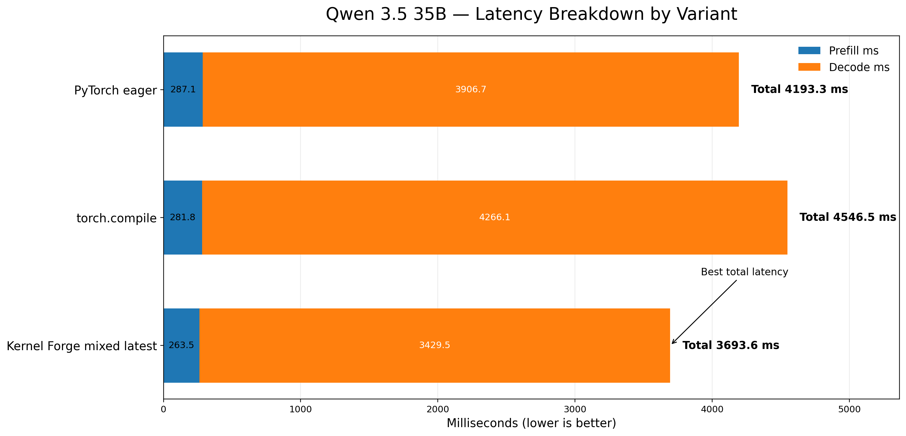
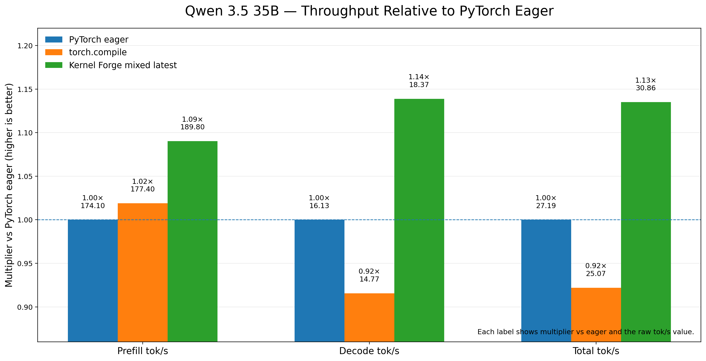

# Kernel Forge

Kernel Forge automatically generates and optimizes GPU kernels for PyTorch models with no kernel programming expertise required. It profiles your model at the operator level, uses an LLM to write a correct kernel, then searches for performance improvements using Monte Carlo Tree Search until the kernel beats PyTorch's baseline.

---

## Who is this for?

- **ML engineers running models in production** who want lower inference latency on specific hardware without writing CUDA or Triton by hand.
- **AI infrastructure teams** targeting specific GPU hardware (NVIDIA CUDA or AMD ROCm) who need kernels tuned to that exact device.
- **Teams with remote GPU access** who run optimization on a separate GPU server while managing projects locally.
- **Researchers** benchmarking operator-level speedups across different LLM backends or optimization strategies.
- **Teams packaging models for deployment** who want a self-contained inference artifact with kernels baked in and no runtime dependency on KernelForge.

---

## Features

### Automated kernel generation
- Hooks into PyTorch's dispatch mechanism to capture real input/output tensor pairs for each operator during a forward pass.
- Prompts an LLM with the operator signature and captured data to generate a candidate kernel.
- Compiles and validates the kernel in a tight loop — compile errors and numerical mismatches are automatically fed back to the LLM until output matches `torch.allclose`.

### MCTS-driven optimization
- Treats optimization as a tree search: each kernel variant is a node, each LLM-suggested rewrite (tiling, loop unrolling, vectorized memory access, etc.) is a child branch.
- Monte Carlo Tree Search balances exploring new strategies against exploiting branches that have already yielded speedups.
- The full tree is persisted to disk so runs can be paused, resumed, or inspected at any time.

### CUDA and Triton backends
- **CUDA**: generates `.cu` kernels compiled via `torch.utils.cpp_extension`. Supports NVIDIA GPUs.
- **Triton**: generates `.py` Triton kernels profiled via `triton.testing.do_bench`. Supports both NVIDIA and **AMD ROCm** GPUs (via `rocm-smi` for device specs).

### Remote execution over SSH
- Both backends support offloading compilation and benchmarking to a remote GPU host over SSH.
- KernelForge bootstraps a Python environment on the remote host automatically (`~/kforge_workspace/venv`), uploading dependencies and worker scripts as needed.
- Auth supports password or key-based (RSA, ED25519, ECDSA, DSA).

### Multi-LLM support
Kernel generation and optimization are driven by any text generation model from the following providers:
- **Anthropic**
- **OpenAI**
- **Google**

Provider is inferred automatically from the selected model name.

### Web dashboard
- Live pipeline status and per-operator progress while runs are active.
- Speed comparison charts (baseline PyTorch vs. optimized kernel) that update as operators complete.
- MCTS tree inspector to browse every optimization attempt and its measured speedup.
- **Automatic mode:** forge all discovered operators in one click.
- **Manual mode:** select specific operators to target.

### Operators profiled
The profiling system targets `torch.nn.functional` operators by default:

| Category | Operators |
|----------|-----------|
| Convolution | `conv1d`, `conv2d`, `conv3d`, `conv_transpose1d`, `conv_transpose2d` |
| Pooling | `max_pool2d`, `avg_pool2d`, `adaptive_avg_pool2d`, `adaptive_max_pool2d` |
| Linear / Attention | `linear`, `scaled_dot_product_attention` |
| Normalization | `layer_norm`, `batch_norm` |
| Activation | `relu`, `gelu`, `softmax` |
| Other | `embedding`, `dropout`, `pad` |

Shape ops, tensor creation ops, and random ops are skipped by default but can be enabled via config.

### Portable project formats
- **`.anvil`**: complete project snapshot (profiling data, kernels, MCTS trees) that can be moved to another machine and resumed inside KernelForge.
- **`.cast`**: self-contained inference package bundling model weights and optimized kernels. Loadable with only `torch` installed; no KernelForge required at inference time.

---

## Benchmark Snapshot

### Qwen 3.5 35B-A3B

On this mixed-workload run, `Kernel Forge mixed latest` delivered the best overall result against both PyTorch eager and `torch.compile`.

- Total latency: `3693.6 ms` vs `4193.3 ms` for PyTorch eager and `4546.5 ms` for `torch.compile`
- Relative to eager throughput: `1.09x` prefill tok/s, `1.14x` decode tok/s, and `1.13x` total tok/s
- In this run, `torch.compile` slightly improved prefill (`1.02x`) but regressed decode (`0.92x`) and total throughput (`0.92x`) relative to eager





---

## System Requirements

### Local machine

| Requirement | Notes |
|-------------|-------|
| Python 3.12+ | Required |
| PyTorch | Any build; CUDA build needed for local CUDA/Triton work |
| `jac` | Required to run the web frontend |
| LLM API key | Anthropic, OpenAI, or Google |

A GPU is not required on the local machine if you use remote execution over SSH.

### For local CUDA kernel generation

| Requirement | Notes |
|-------------|-------|
| NVIDIA GPU | Any CUDA-capable device |
| CUDA Toolkit 12.0+ | Required for JIT kernel compilation |
| NVIDIA driver ≥ 525 | Required for `nvidia-ml-py` profiling |
| `ninja` | Faster JIT compilation (installed via `requirements.txt`) |

### For local Triton kernel generation

| Requirement | Notes |
|-------------|-------|
| NVIDIA GPU **or** AMD ROCm GPU | Both supported |
| Triton | Installed via `requirements.txt` |
| `rocm-smi` | Required for AMD GPU device spec detection |

### Remote execution (SSH)

The remote host needs Python 3 and a CUDA or ROCm GPU. KernelForge installs everything else automatically on first connect.

---

## Setup

```bash
python -m venv .venv
source .venv/bin/activate
pip install -r requirements.txt

cd frontend
jac install
```

Configure your LLM provider key via the settings panel in the UI after starting the server. Alternatively, set it as an environment variable before starting — `ANTHROPIC_API_KEY`, `OPENAI_API_KEY`, or `GOOGLE_API_KEY`. The provider is inferred automatically from whichever key is present.

---

## Run the UI

```bash
cd frontend
jac start main.jac
```

Open `http://localhost:8000`. Create a project, upload your model weights, and click **Start Forge**.

---

## CLI workflow

Use `src.optimizer.workflow` for headless or scripted runs.

### 1. Profile

```bash
python -m src.optimizer.workflow profile --project <project_name>
```

Captures operator I/O tensors and baseline benchmark data.

### 2. Generate kernels

```bash
# All operators
python -m src.optimizer.workflow generate \
  --project <project_name> \
  --target-device cuda

# Selected operators only
python -m src.optimizer.workflow generate \
  --project <project_name> \
  --ops torch_nn_functional_conv2d,torch_nn_functional_linear \
  --target-device cuda
```

### 3. Optimize + benchmark (end-to-end)

```bash
python -m src.optimizer.workflow generate \
  --project <project_name> \
  --target-device cuda \
  --optimize \
  --benchmark \
  --iterations 5
```

### 4. Optimize existing kernels

```bash
python -m src.optimizer.workflow optimize \
  --project <project_name> \
  --ops torch_nn_functional_conv2d \
  --target-device cuda \
  --iterations 5 \
  --benchmark
```

### 5. Benchmark only

```bash
python -m src.optimizer.workflow benchmark --project <project_name>
```

---

## Project artifact layout

```
kernels/projects/<project_name>/
├── state.json                          # job state (progress, pause/cancel)
├── io/
│   ├── summary.json
│   └── individual_ops/                 # captured tensor I/O per operator
├── kernels/
│   └── generated/individual_op_kernels/<op>/
├── trees/<op>/                         # MCTS nodes and kernel source per attempt
├── benchmarks/op_benchmarks.json
└── logs/
```

---

## Further reading

- `docs/system-architecture.md`: generator and optimizer pipeline in detail
- `docs/FileFormat.md`: `.anvil` and `.cast` format specification
- `docs/cast-runtime.md`: `run_cast.py` CLI reference and known limitations
- `docs/profiling/`: profiling API and architecture
- `src/README.md`: backend source layout
- `frontend/README.md`: frontend walker API
